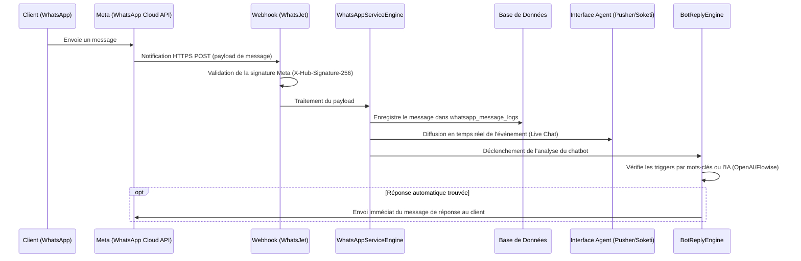

# Résumé d'Analyse du Projet - WhatsJet

Ce document présente un résumé technique détaillé du projet **WhatsJet**, une plateforme d'automatisation WhatsApp Business API.

---

## 1. Présentation du Projet
* **Nom du produit** : WhatsJet (version 7.2.5)
* **Objectif** : Une solution SaaS multi-locataires (multi-tenant) permettant aux entreprises (vendors/locataires) de connecter leur API WhatsApp Cloud officielle de Meta pour automatiser le marketing, orchestrer des campagnes de diffusion en masse, créer des chatbots interactifs (et IA), et gérer une boîte de réception partagée (Live Chat) pour leurs équipes de support.
* **Cadre technique** : Construit sur le framework **Laravel 12** (PHP 8.2), utilisant une architecture MVC modulaire robuste.

---

## 2. Architecture Logicielle
L'application implémente une structure modulaire personnalisée appelée **Yantrana** (située sous `app/Yantrana`), qui sépare de façon très stricte les responsabilités en suivant le motif de conception MVC :

1. **Controllers (Contrôleurs)** : 
   * Placés dans chaque composant (ex. `app/Yantrana/Components/BotReply/Controllers`).
   * Gèrent les requêtes HTTP, valident les données entrantes via les requêtes Laravel (`BaseRequest`) et appliquent les contrôles de sécurité.
2. **Engines (Moteurs de logique métier)** :
   * Contiennent toute la logique applicative complexe (coordination des APIs, calculs de plans, logique d'envoi de messages, formats d'exportation).
   * Servent d'intermédiaire entre les Contrôleurs et les Référentiels (Repositories).
3. **Repositories (Référentiels)** :
   * Isoler les requêtes de base de données (Eloquent / Query Builder).
   * Assurent qu'aucune requête SQL brute ou logique d'accès aux données ne pollue les contrôleurs ou les moteurs de traitement.
4. **Models (Modèles)** :
   * Modèles Eloquent décrivant les structures de tables et gérant les relations (ex. `bot_replies`, `contacts`, `vendors`).
5. **Interfaces** :
   * Définissent les contrats d'architecture pour garantir la cohérence dans le typage et l'injection de dépendances.
6. **Support** :
   * Contient les aides globales (`app-helpers.php`), le système de gestion des traductions Gettext (`php-gettext`), les directives Blade étendues et les validations personnalisées.

---

## 3. Fonctionnalités Clés et Modules Principaux

Le projet se compose de 15 modules principaux dans `app/Yantrana/Components` :

* **Auth** : Gère l'authentification des utilisateurs, l'inscription des vendors, la double authentification (2FA) et la réinitialisation sécurisée des mots de passe.
* **Vendor** & **User** : Fournissent la structure multi-tenant. Les administrateurs généraux gèrent les vendors, et chaque vendor gère ses propres utilisateurs/agents (Team Members) et leurs permissions d'accès.
* **WhatsAppService** : Noyau central d'intégration avec l'API WhatsApp Cloud de Meta. Gère la configuration de l'API, la synchronisation des numéros de téléphone et des modèles de messages (templates approuvés), ainsi que la réception des webhooks de Meta.
* **BotReply** & **BotFlow** : 
  * *Bots simples* : Réponses basées sur des déclencheurs textuels (triggers).
  * *Bots interactifs* : Messages avec boutons, messages de type liste, et boutons avec URL externe (CTA).
  * *Bot Flows* : Un constructeur visuel pour guider les clients à travers des flux de discussion complexes par étapes.
  * *Chatbots IA* : Intégrations avec OpenAI (Assistant API) et FlowiseAI pour générer des réponses automatiques intelligentes et contextuelles.
* **Campaign** : Planification et exécution de campagnes de messagerie de masse (Broadcasts). Gère les files d'attente (`whatsapp_message_queue`), le rythme d'envoi par lot (throughput throttling) et génère des rapports de livraison détaillés.
* **Contact** & **CRM** : Fiches contacts avec notes, labels (étiquettes), groupes de diffusion, import/export Excel et champs personnalisés dynamiques (Custom Fields) pour collecter des métadonnées spécifiques.
* **Dashboard** : Rapports de statistiques pour les administrateurs généraux (revenus, abonnements, statistiques des locataires) et pour les vendors (volumes de messages, statuts d'envoi/lecture, efficacité des campagnes).
* **Subscription** : Gestion de la monétisation avec Stripe (Laravel Cashier) pour les forfaits récurrents, Paypal/Razorpay pour les paiements uniques, et un workflow de validation manuelle pour les paiements hors ligne (virement bancaire/UPI).
* **Translation** : Outils de localisation natifs basés sur Gettext pour traduire l'intégralité de la plateforme dans de multiples langues via l'interface d'administration.

---

## 4. Modèle de Données (Base de Données)
La base de données relationnelle est optimisée et modélisée selon les besoins fonctionnels. Les tables majeures incluent :

| Catégorie | Table(s) | Rôle / Description |
| :--- | :--- | :--- |
| **SaaS / Tenants** | `vendors`, `vendor_settings`, `vendor_users` | Stocke les informations des locataires, leurs clés d'API (WhatsApp, OpenAI) et lie les utilisateurs aux entreprises. |
| **Utilisateurs** | `users`, `user_roles`, `user_settings` | Gère les profils (superadmins, admins de vendors, agents), leurs configurations et rôles. |
| **Messagerie** | `whatsapp_message_logs`, `whatsapp_message_queue`, `whatsapp_templates` | Enregistre l'historique de tous les messages (entrants/sortants), la file d'attente d'envoi des campagnes, et les modèles de messages Meta. |
| **Contacts / CRM** | `contacts`, `contact_groups`, `group_contacts`, `labels`, `contact_labels`, `contact_custom_fields`, `contact_custom_field_values` | Gère les bases de données clients de chaque vendor, leur segmentation par groupes/étiquettes, et leurs attributs personnalisés. |
| **Chatbots** | `bot_replies`, `bot_flows` | Stocke les règles de réponses automatiques (simples, interactives) et les designs visuels d'arborescences de bots. |
| **Paiements** | `subscriptions`, `subscription_items`, `manual_subscriptions`, `transactions` | Gère la facturation récurrente Stripe, les abonnements manuels et l'historique des transactions financières. |

---

## 5. Flux de Fonctionnement Majeurs

### A. Réception d'un message WhatsApp (Webhook Meta)

### B. Envoi d'une Campagne de Diffusion (Broadcast)
1. Le vendor définit sa campagne en sélectionnant un modèle approuvé, des groupes cibles et éventuellement une planification temporelle.
2. Les enregistrements de messages individuels à envoyer sont générés et stockés dans `whatsapp_message_queue`.
3. Le planificateur Laravel (`php artisan schedule:run` configuré en tâche CRON sur le serveur) exécute les tâches de messagerie en tâche de fond.
4. Les messages sont envoyés par lots successifs (lotting / throttling) pour ne pas saturer le serveur et respecter les limites de débit de l'API Meta.
5. Lorsque Meta traite l'envoi, elle renvoie des statuts de confirmation par Webhook. Le statut du message passe ainsi de `Accepted` à `Sent`, puis `Delivered`, et enfin `Read` dans `whatsapp_message_logs`.

---

## 6. Bonnes Pratiques de Sécurité et de Développement Appliquées
En cohérence avec les principes d'OWASP et de développement de l'application :
* **Prévention contre l'Injection SQL** : Toutes les requêtes en base de données transitent par l'ORM Eloquent ou le Query Builder qui utilisent des requêtes préparées (PDO) sous le capot.
* **Contrôle d'accès robuste** : Les routes sont protégées par les middlewares `Authenticate`, `CentralAccessCheckpost` (pour le SuperAdmin) et `VendorAccessCheckpost` (pour les Vendors). De plus, l'accès aux fonctionnalités est validé dynamiquement via `validateVendorAccess` pour vérifier les rôles et forfaits d'abonnement.
* **Sécurité de l'Authentification** : Gestion des sessions via Fortify avec possibilité d'activer l'authentification multi-facteurs (2FA), jetons CSRF pour chaque requête POST/PUT, et hachage fort (Bcrypt) des mots de passe.
* **Délégation et APIs** : Utilisation d'APIs externes sécurisées pour les opérations sensibles (Stripe pour les paiements, OpenAI pour le traitement de l'IA, Meta pour l'envoi WhatsApp).
